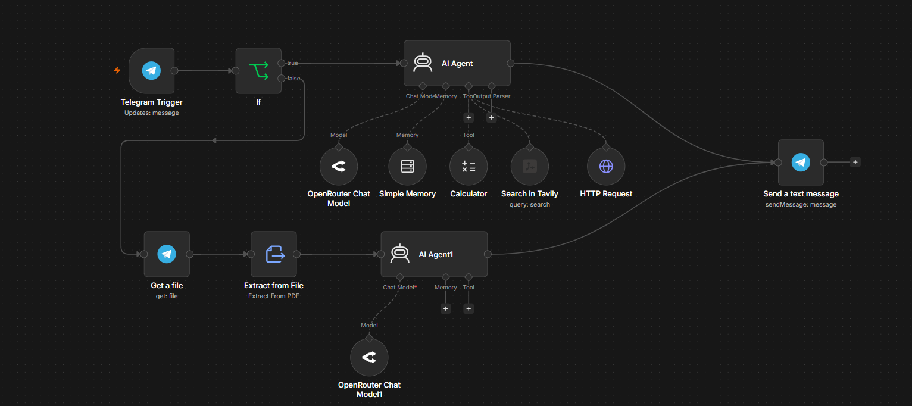
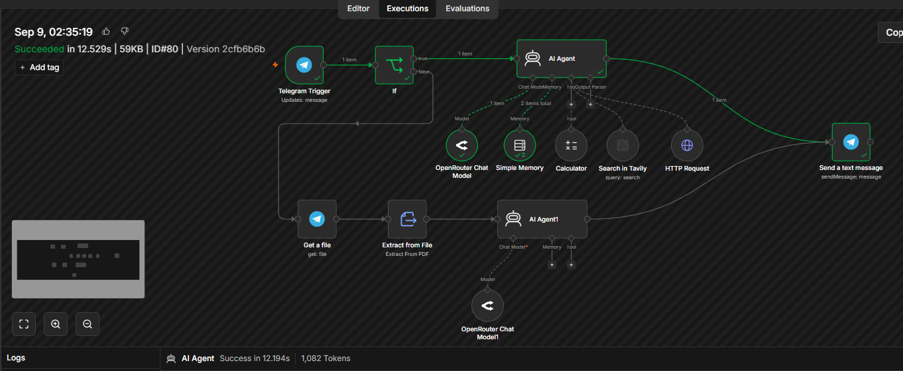
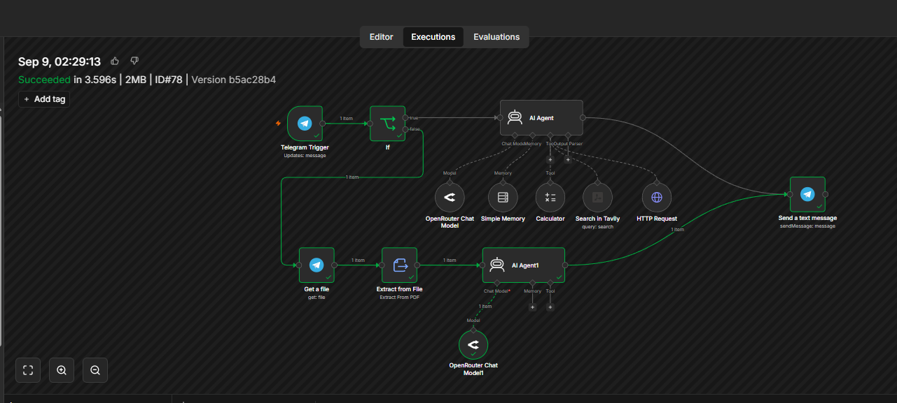
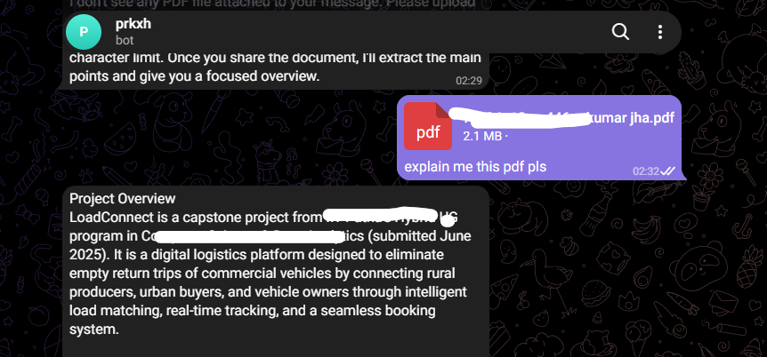
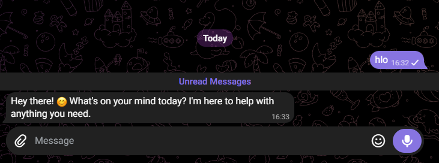

## Telegram AI Assistant with n8n

An AI Agent workflow built with n8n that works directly through Telegram.

The assistant can handle both normal conversations and PDF documents. It can receive a PDF through Telegram, retrieve the file, extract its text, analyze the content using an AI Agent, and return the response directly to the user.

Workflow
```
Telegram Trigger
       │
       ▼
      IF
   ┌───┴──────────────┐
   │                  │
Text Message        PDF File
   │                  │
   ▼                  ▼
AI Agent           Get File
                      │
                      ▼
                Extract from PDF
                      │
                      ▼
                 PDF AI Agent
                      │
   ┌──────────────────┘
   │
   ▼
Send Telegram Message
```
## Features
- Chat with an AI Agent directly through Telegram.
- Handle both normal messages and PDF files.
- Retrieve and process PDFs sent through Telegram.
- Extract text from PDF documents.
- Analyze extracted content using a dedicated AI Agent.
- Generate concise document summaries and answers.
- Maintain conversational context using Simple Memory.
- Use Calculator, Tavily Search, and HTTP Request tools.
- Use OpenRouter as the AI model provider.
- Return responses directly to the Telegram user.
## Tech Stack
- n8n
- Telegram
- AI Agent
- OpenRouter
- Simple Memory
- PDF Processing
- Calculator
- Tavily Search
- HTTP Request

## Architecture

The workflow uses conditional routing to process incoming Telegram messages through two paths: normal chat and PDF processing.

### Text Message
```
Telegram
   │
   ▼
Telegram Trigger
   │
   ▼
IF
   │
   ▼
AI Agent
   │
   ▼
Send Telegram Message
```
The AI Agent handles normal conversations and can use connected tools such as memory, calculator, web search, and HTTP requests when required.

### PDF File
```
Telegram
   │
   ▼
Telegram Trigger
   │
   ▼
IF
   │
   ▼
Get File
   │
   ▼
Extract from PDF
   │
   ▼
PDF AI Agent
   │
   ▼
Send Telegram Message
```
When a PDF is received, the workflow retrieves the file and extracts its text before passing the content to the document-analysis AI Agent.

## How It Works
- The user sends a message or PDF through Telegram.
- The Telegram Trigger receives the incoming update.
- The IF node determines whether the input is a normal message or a PDF.
- Text messages are sent directly to the main AI Agent.
- PDF messages are passed to Get File to retrieve the document.
- Extract from File extracts the text from the PDF.
- The extracted content is passed to the PDF AI Agent for analysis.
- The generated response is sent back through Telegram using Send a text message.
Example

A user can send:
```
[PDF File]

Explain this PDF in short.
```
The workflow processes the document and returns a concise summary directly in Telegram.

The same assistant can also handle normal requests such as:
```
What is the difference between REST and GraphQL?
```
### AI Agent Tools

The main AI Agent is connected to multiple tools:
```
AI Agent
   │
   ├── OpenRouter Chat Model
   ├── Simple Memory
   ├── Calculator
   ├── Tavily Search
   └── HTTP Request
```
These tools allow the agent to handle more than simple text generation and use external capabilities when required.

### PDF Analysis Flow

The PDF workflow demonstrates a complete document-processing pipeline:
```
Telegram File
      ↓
File Retrieval
      ↓
PDF Text Extraction
      ↓
AI Analysis
      ↓
Summary / Answer
      ↓
Telegram
```
This separates file handling, document extraction, and AI processing into individual workflow steps, making the automation easier to understand and extend.

## Screenshots

### Complete n8n Workflow



The complete workflow showing Telegram message handling, conditional routing, AI Agents, PDF processing, memory, and external tools.

### Normal AI Chat



The assistant handling a normal conversational message directly through Telegram.

### PDF Upload



A PDF document being sent to the Telegram AI Assistant for processing.

### PDF Analysis Response



The AI Agent analyzing the extracted PDF content and returning a response directly in Telegram.

### Telegram Assistant Response



A normal Telegram interaction demonstrating the assistant responding successfully.

## Workflow Files
```
telegram-ai-agent/
│
├── workflow.json
├── README.md
├── workflow.png
├── telegram-chat.png
├── telegram-pdf.png
├── telegram-pdf-response.png
└── telegram-response.png
```
Import the workflow.json file into n8n and configure the required credentials.

## What I Learned

While building this project, I learned:
- How to build an AI Agent workflow using n8n.
- How to connect Telegram with an AI Agent.
- How to design multi-path automation workflows for different types of user input.
- How to route different message types using conditional logic.
- How to retrieve files sent through Telegram.
- How to extract text from PDF documents inside an automation workflow.
- How to pass extracted document content to an AI Agent.
- How to connect external tools with an AI Agent.
- How to combine conversational AI and document processing in a single workflow.

The main takeaway was understanding how different automation components can be combined to build a practical AI application:
```
User
 ↓
Telegram
 ↓
n8n Workflow
 ↓
AI Agent / PDF Processing
 ↓
Tools
 ↓
Response
 ↓
Telegram
```
## Future Improvements
- Support additional document and image formats.
- Improve handling of long PDF documents.
- Add voice-message support.
- Add more external tools and APIs.
- Add authentication and user-specific settings.
- Improve conversational memory.
## Import Workflow

Import the ```workflow.json``` file into your n8n instance and configure the required credentials.

Required services include:

- Telegram Bot
- OpenRouter
- Tavily

After configuring the credentials, activate the workflow and interact with the assistant through Telegram.

> Note: Do not commit API keys, bot tokens, OAuth credentials, or other sensitive information to the repository.

If you find this workflow useful, consider giving the repository a star.
