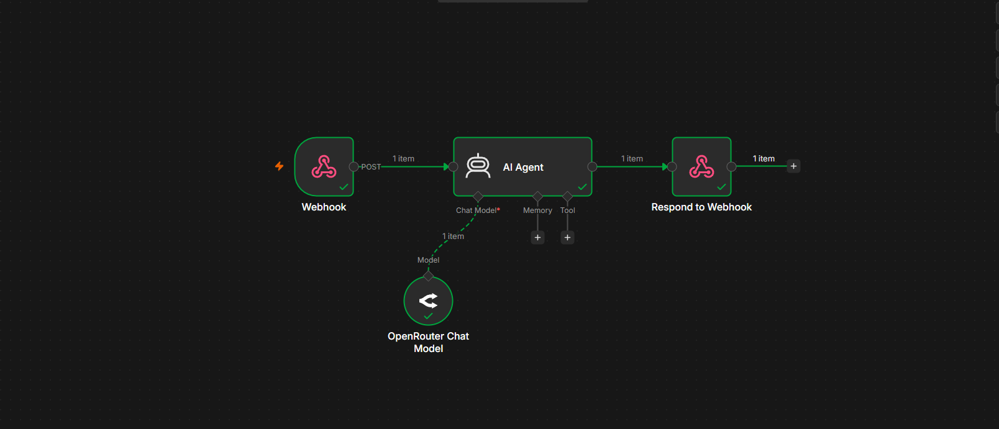
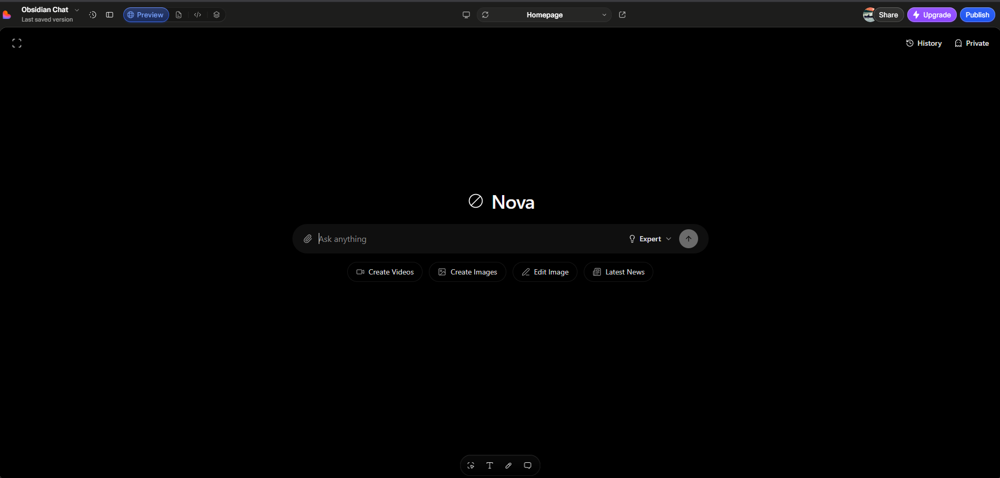
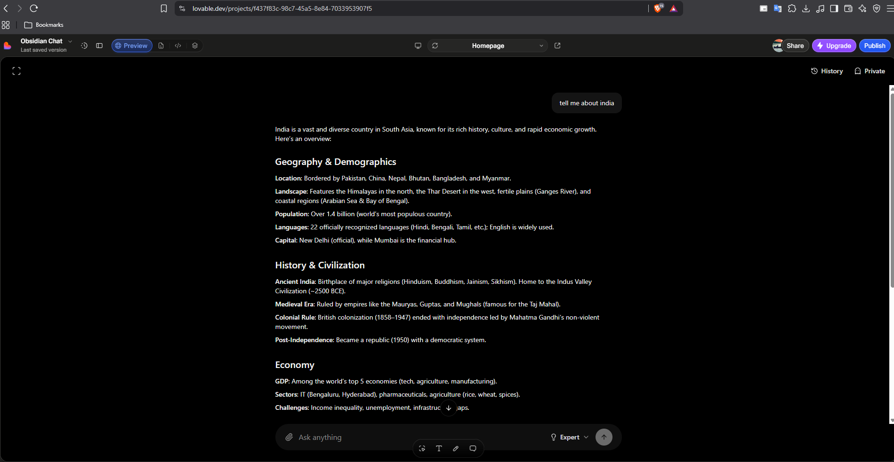

# AI Chat Agent API

An AI-powered chat backend built with **n8n**.

This workflow exposes a webhook endpoint that receives user messages, processes them using an AI Agent powered by OpenRouter, and returns AI-generated responses in real time.

---

## Workflow

```text
Client / Frontend
        │
        ▼
Webhook (POST)
        │
        ▼
AI Agent (OpenRouter)
        │
        ▼
Respond to Webhook
        │
        ▼
AI Response
```

---

## Features

- Expose an AI Agent through a Webhook.
- Accept user messages via HTTP POST requests.
- Generate responses using OpenRouter.
- Return AI-generated responses instantly.
- Easily connect with any frontend application.

---

## Tech Stack

- n8n
- AI Agent
- OpenRouter
- DeepSeek Chat
- Webhooks
- REST API

---

## Workflow Steps

1. The client sends a POST request to the webhook.
2. The webhook triggers the workflow.
3. The AI Agent receives the user's message.
4. OpenRouter generates the response.
5. The workflow returns the response to the client.

---

## API

### Endpoint

```http
POST /mychatapp
```

### Request

```json
{
  "message": "Tell me about India"
}
```

### Response

```json
{
  "output": "India is a country in South Asia..."
}
```

---

## Folder Structure

```text
ai-chat-agent-api/
│
├── workflow.json
├── README.md
├── workflow.png
├── chat-ui.png
└── response.png
```

---

## Screenshots

### Workflow



### Chat Interface



### Example Response



---

## What I Learned

While building this workflow, I learned:

- Webhooks in n8n
- HTTP Requests & Responses
- AI Agents
- OpenRouter Chat Models
- Exposing AI as an API
- Dynamic Expressions
- End-to-end Request Flow

Understanding how a request moves from a client, through a webhook, into an AI Agent, and back as a response was the biggest takeaway from this project.

---

## Future Improvements

- Conversation Memory
- RAG Integration
- Tool Calling
- MCP Support
- Authentication
- Streaming Responses
- Chat History

---

## Import Workflow

Import the included `workflow.json` file into n8n, configure your OpenRouter credentials, activate the workflow, and start sending POST requests to the webhook endpoint.

---

If you find this workflow useful, consider giving the repository a star.
