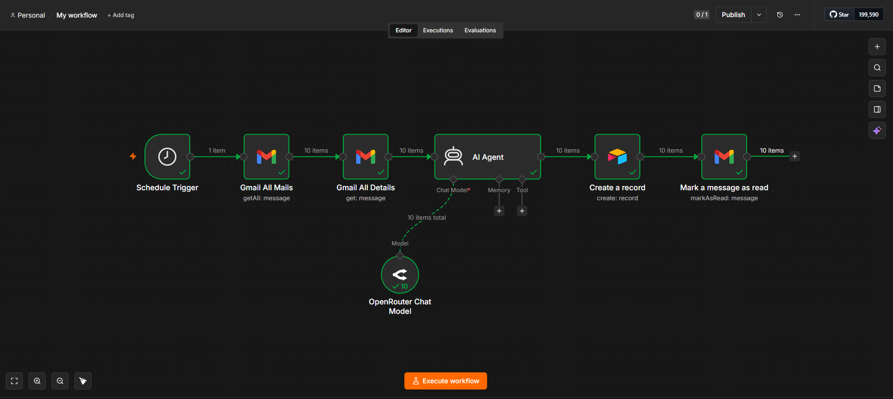
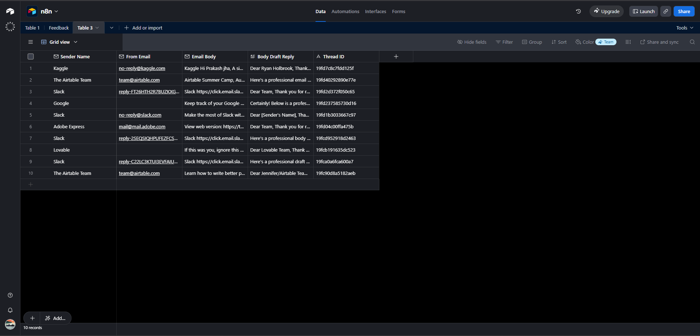

# AI Email Reply Agent

An AI-powered email automation workflow built with **n8n**.

This workflow automatically retrieves unread Gmail messages, generates professional draft replies using an AI Agent powered by OpenRouter, stores the email details and generated draft in Airtable, and marks processed emails as read to prevent duplicate processing.

---

## Workflow

```text
Schedule Trigger
        │
        ▼
Fetch Unread Emails (Gmail)
        │
        ▼
Retrieve Email Details
        │
        ▼
AI Agent (OpenRouter)
        │
        ▼
Store Draft Reply (Airtable)
        │
        ▼
Mark Email as Read (Gmail)
```

---

## Features

- Automatically checks Gmail for unread emails.
- Retrieves complete email details.
- Generates professional draft replies using an AI Agent.
- Stores sender details, email content, AI-generated draft, and thread ID in Airtable.
- Marks processed emails as read.
- Prevents duplicate processing.

---

## Tech Stack

- n8n
- AI Agent
- OpenRouter
- Gmail API
- Airtable

---

## Workflow Steps

1. The workflow starts on a schedule.
2. Unread emails are fetched from Gmail.
3. Email details are retrieved.
4. The AI Agent generates a professional draft reply.
5. The email information and generated draft are stored in Airtable.
6. The processed email is marked as read.

---

## Folder Structure

```text
ai-email-reply-agent/
│
├── workflow.json
├── README.md
├── workflow.png
└── airtable.png
```

---

## Screenshots

### Workflow



### Airtable Output



---

## What I Learned

Building this workflow helped me understand:

- Scheduled automations in n8n
- Gmail integrations
- AI Agents with OpenRouter
- Prompt engineering for email drafting
- Airtable integrations
- End-to-end automation workflows

The biggest learning was understanding how multiple services can work together in a single automation pipeline while ensuring emails are processed only once.

---

## Future Improvements

- Reply directly from Gmail
- Email categorization
- Priority detection
- Conversation memory
- Attachment handling
- Human approval before sending replies

---

## Import Workflow

Import the included `workflow.json` into n8n, configure your Gmail, OpenRouter, and Airtable credentials, then activate the workflow.

---

If you find this workflow useful, consider giving the repository a star.
