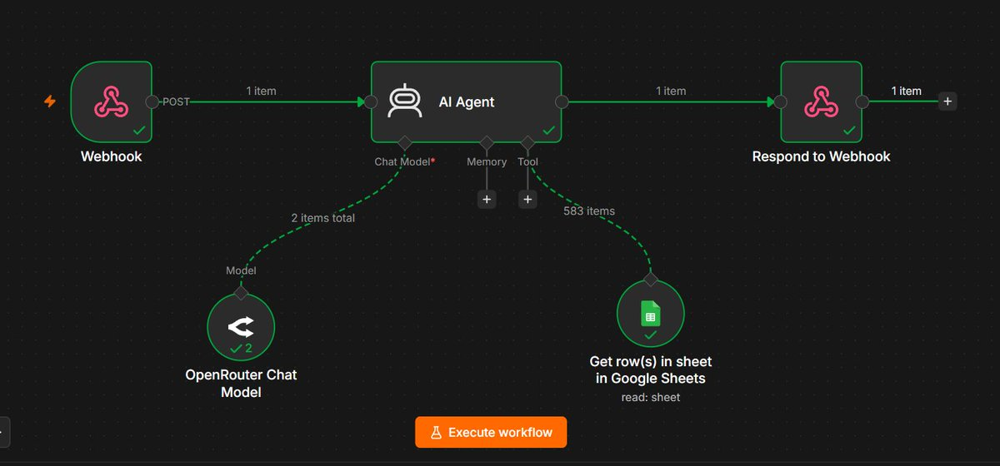
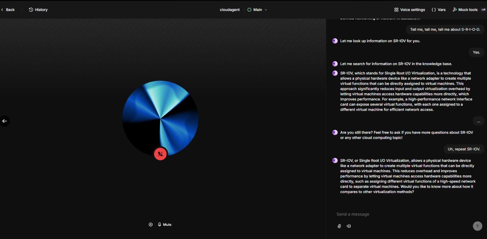

# Cloud Computing Voice AI Agent

A small voice-based AI agent built using **ElevenLabs, n8n, OpenRouter, and Google Sheets**.

The agent answers questions about my Cloud Computing notes by using a Google Sheets knowledge base through an n8n workflow.

## Workflow

```text
User
  │
  ▼
ElevenLabs Voice Agent
  │
  ▼
n8n Webhook
  │
  ▼
AI Agent
  │
  ├── OpenRouter
  │
  └── Google Sheets
  │
  ▼
Respond to Webhook
  │
  ▼
Voice Response
```


## How It Works
- User asks a Cloud Computing question through the voice agent.
- ElevenLabs sends the question to the n8n webhook.
- The n8n AI Agent receives the question and uses the Google Sheets knowledge base.
- OpenRouter generates the response based on the retrieved information.
- The response is sent back through the webhook.
- ElevenLabs converts the response into a voice reply.

##  Knowledge Base

The Google Sheets knowledge base contains notes from my Cloud Computing coursework, covering topics such as:

- Cloud Computing & Virtualization
- Software-Defined Networking
- Distributed Systems
- Cloud Storage & NoSQL
- Peer-to-Peer Systems
- MapReduce
- Apache Spark
- Apache Kafka
- Leader Election
- Clock Synchronization
- Cassandra
- HBase
- Docker
- Network Virtualization
- Distributed Algorithms
- DHTs

The agent is configured to use the knowledge base first when answering Cloud Computing questions.

## Tech Stack
- ElevenLabs — Voice AI agent
- n8n — Workflow automation and AI Agent
- OpenRouter — LLM provider
- Google Sheets — Knowledge base
- Webhooks — Communication between ElevenLabs and n8n

## Example
```
"What are the challenges of SDN?"
```


The agent searches the Cloud Computing knowledge base and returns the relevant information through a voice response.

## Files

- `workflow.json` — n8n workflow
- `elevenlabs-agent.json` — ElevenLabs agent configuration
- `workflow.png` — n8n workflow diagram
- `elevenlabs-agent.png` — ElevenLabs voice agent
- `README.md` — Project documentation
  
## What I Learned
- Building voice AI agents
- Working with n8n AI Agents
- Webhook integration
- Tool calling
- Using Google Sheets as a knowledge base
- Connecting ElevenLabs with n8n
- Connecting voice interfaces with AI workflows
## Limitations

This is currently a small learning project. The agent's knowledge is limited to the content available in the Cloud Computing knowledge base, and voice testing depends on the available ElevenLabs usage.
