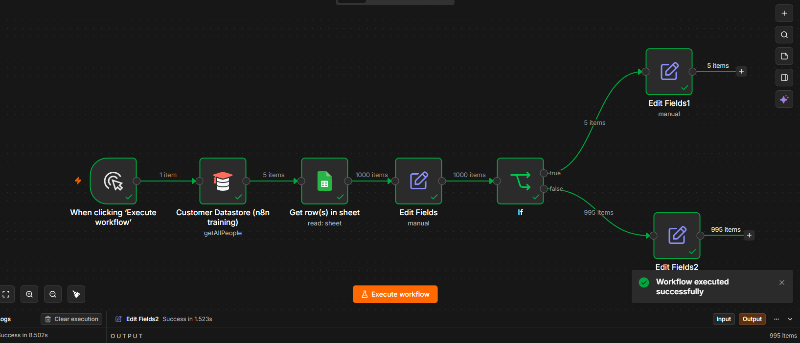

# Customer Data Processing Workflow

A simple n8n workflow that reads customer records from Google Sheets, transforms the required fields, and routes the data using conditional logic.

## Workflow Preview



---

## How It Works

1. Trigger the workflow manually.
2. Read customer records from Google Sheets.
3. Extract the required fields using the **Edit Fields** node.
4. Check whether the customer's country is **China** using an **IF** node.
5. Route the records based on the condition.
6. Return the required fields for each branch.

---

## Features

- Reads customer records from Google Sheets
- Transforms data using the Edit Fields node
- Routes records using an IF node
- Beginner-friendly workflow
- Easy to customize for different conditions

---

## Tech Stack

- n8n
- Google Sheets
- Edit Fields Node
- IF Node

---

## Workflow

```text
Manual Trigger
      │
      ▼
Google Sheets (Get Rows)
      │
      ▼
Edit Fields
      │
      ▼
IF (Country == China)
     ├────────► True
     │
     └────────► False
```

---

## Sample Data

A sample dataset is included in the **sample-data** folder.

Fields include:

- customer_id
- first_name
- last_name
- email
- phone_number
- country
- status
- total_orders
- total_spent
- signup_date
- last_purchase

Import the CSV into Google Sheets before running the workflow.

---

## Files

- `workflow.json` — Exported n8n workflow
- `README.md` — Documentation
- `workflow.png` — Workflow preview
- `sample-data/customer_mock_data.csv` — Sample dataset

---

## Learning

This workflow demonstrates the fundamentals of data processing in n8n, including:

- Reading data from Google Sheets
- Transforming data with Edit Fields
- Using conditional logic with an IF node
- Routing records based on conditions

A great beginner workflow for understanding how data flows through an automation.
