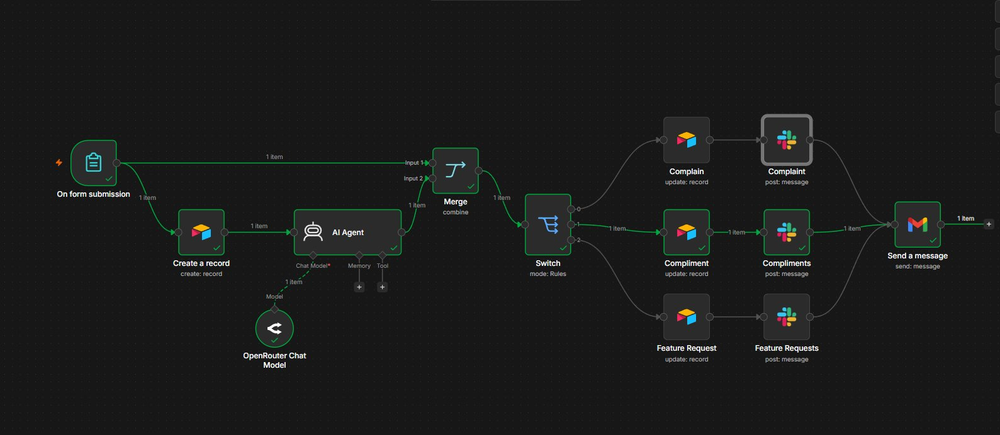
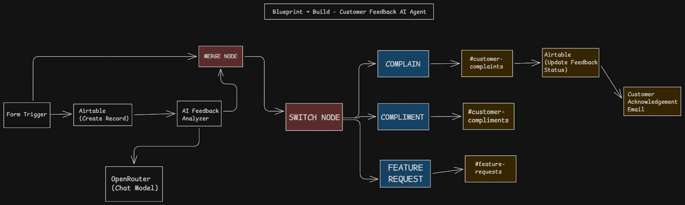
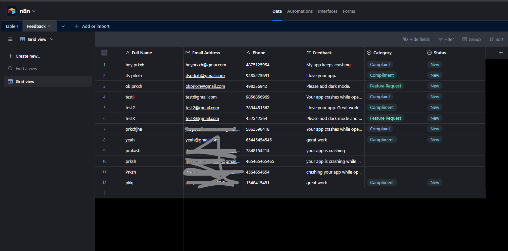
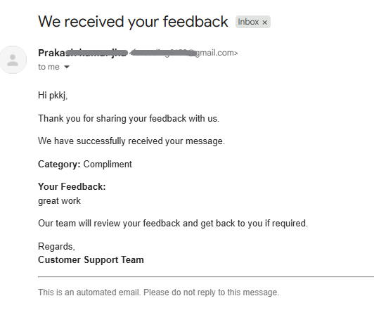

# Customer Feedback AI Agent

An AI-powered customer feedback automation workflow built with **n8n**.

This workflow collects customer feedback, classifies it using an AI Agent powered by OpenRouter, routes it to the appropriate Slack channel, updates Airtable automatically, and sends an acknowledgement email to the customer.

---

## Workflow

```text
Customer Feedback Form
          │
          ▼
Create Airtable Record
          │
          ▼
AI Agent (OpenRouter)
          │
          ▼
Merge
          │
          ▼
Switch
   ┌──────────────┬──────────────┐
   │              │              │
Complaint    Compliment    Feature Request
   │              │              │
   ▼              ▼              ▼
Update       Update         Update
Airtable     Airtable       Airtable
   │              │              │
   ▼              ▼              ▼
Slack         Slack          Slack
        └──────────────┬──────────────┘
                       ▼
        Customer Acknowledgement Email
```

---

## Features

- Collect customer feedback using an n8n Form.
- Store every submission in Airtable.
- Classify feedback using an AI Agent powered by OpenRouter.
- Categorize feedback into:
  - Complaint
  - Compliment
  - Feature Request
- Route each category to its dedicated Slack channel.
- Update the Airtable record automatically.
- Send an acknowledgement email to the customer.
- Fully automated end-to-end workflow.

---

## Tech Stack

- n8n
- OpenRouter
- AI Agent
- Airtable
- Slack
- Gmail

---

## Workflow Steps

1. Customer submits the feedback form.
2. A new record is created in Airtable.
3. The AI Agent analyzes the feedback.
4. The response is classified as:
   - Complaint
   - Compliment
   - Feature Request
5. The Switch node routes the workflow based on the AI output.
6. Airtable is updated with the category and status.
7. A notification is sent to the appropriate Slack channel.
8. An acknowledgement email is sent to the customer.

---

## Folder Structure

```text
customer-feedback-ai-agent/
│
├── workflow.json
├── README.md
├── workflow.png
├── blueprint.png
├── airtable.png
├── slack.png
└── email.png
```

---

## Screenshots

### Workflow



### Blueprint



### Airtable



### Customer Email



---

## What I Learned

Building this workflow helped me understand how data flows through an automation pipeline.

Some of the key concepts I worked with include:

- AI Agents in n8n
- OpenRouter Chat Models
- Merge and Switch nodes
- Dynamic expressions
- Airtable CRUD operations
- Slack integration
- Gmail automation
- End-to-end workflow debugging

Most of the effort went into debugging node mappings, routing logic, and expressions to make the workflow reliable from start to finish.

---

## Future Improvements

- AI-generated summaries
- Priority detection
- Duplicate feedback detection
- AI-generated reply suggestions
- Analytics dashboard

---

## Import Workflow

Import the included `workflow.json` file directly into n8n to use or customize the workflow.

---

If you find this workflow useful, consider giving the repository a star.
