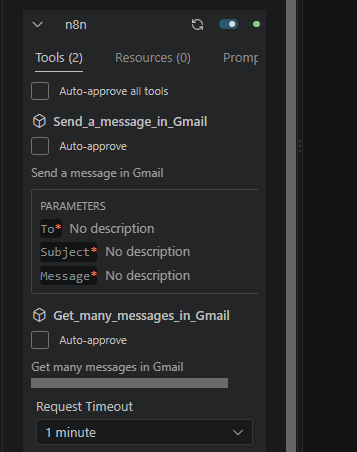
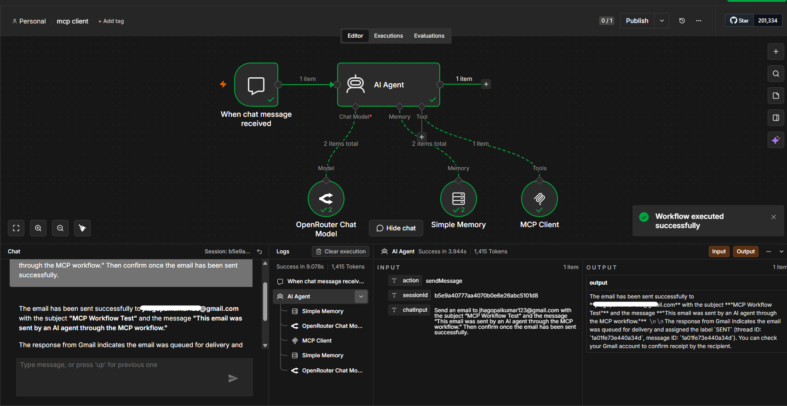
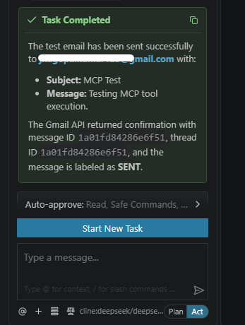
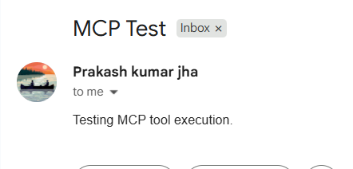

# MCP AI Agent with n8n

An AI Agent workflow built with **n8n** using the **Model Context Protocol (MCP)**.

This project connects an AI Agent to an MCP Client, which communicates with an MCP Server exposing Gmail tools. The agent can understand a user's request, select the appropriate tool, execute it through MCP, and return the result.

## Workflow

```text
User
        │
        ▼
AI Agent
        │
        ▼
MCP Client
        │
        ▼
MCP Server
        │
        ├──────────────► Gmail: Read Messages
        │
        └──────────────► Gmail: Send Message
                              │
                              ▼
                         Email Sent
```
# Features
- Connect an AI Agent with external tools using MCP.
- Build an MCP Server using n8n.
- Expose Gmail operations as MCP tools.
- Connect an MCP Client to the MCP Server.
- Allow the AI Agent to select and execute tools based on natural-language instructions.
- Read Gmail messages through MCP.
- Send emails through MCP.
- Test the MCP Server using Cline.
- Use the same MCP tools from an n8n AI Agent.

# Tech Stack
- n8n
- Model Context Protocol (MCP)
- AI Agent
- MCP Client
- Cline
- OpenRouter
- Gmail
- Simple Memory


# Architecture

The project consists of two main parts:

**MCP Server**

The n8n MCP Server exposes tools that can be used by MCP clients.
```
MCP Server
    │
    ├── Gmail: Get Many Messages
    │
    └── Gmail: Send Message
```
**AI Agent + MCP Client**

The AI Agent uses an MCP Client to discover and call the tools exposed by the MCP Server.
```
User
  │
  ▼
AI Agent
  │
  ▼
MCP Client
  │
  ▼
MCP Server
  │
  ▼
Gmail Tool
```
# How It Works
- The user sends a request to the AI Agent.
- The AI Agent understands the request.
- The MCP Client provides access to the available MCP tools.
- The agent selects the required tool.
- The MCP Client sends the tool call to the MCP Server.
- The MCP Server executes the requested Gmail operation.
- The result is returned to the AI Agent.
- The AI Agent responds to the user.

**Example**

A user can ask the AI Agent:

```Send a test email to example@gmail.com```

The agent can then:
```
User Request
     ↓
AI Agent
     ↓
MCP Client
     ↓
Send Message in Gmail
     ↓
MCP Server
     ↓
Gmail
     ↓
Email Sent
```
The same MCP Server can also expose tools for retrieving Gmail messages.

# MCP Client with Cline

Cline was used as an MCP client to connect to the n8n MCP Server.

After connecting, Cline can discover the tools exposed by the server, including:
```
Get_many_messages_in_Gmail
Send_a_message_in_Gmail
```
This was also used to test real tool execution through MCP.

## Screenshots

### MCP Server


### MCP Tools in Cline


### AI Agent Workflow


### MCP Tool Execution


### Email Sent Successfully


# Workflow Files
```
mcp-ai-agent-n8n/
│
├── workflow.json
├── README.md
├── workflow.png
├── mcp-server.png
├── mcp-client.png
├── ai-agent.png
├── tool-execution.png
└── email-result.png
```
# What I Learned

While building this project, I learned:

- How MCP works as a common interface between AI Agents and external tools.
- How to create an MCP Server using n8n.
- How to expose workflow operations as MCP tools.
- How MCP Clients discover and call available tools.
- How to connect an MCP Server with Cline.
- How to connect MCP tools to an n8n AI Agent.
- How an AI Agent can decide which tool to use based on a natural-language request.
- How to perform real-world tool execution through MCP.

The biggest takeaway was understanding the complete flow:
```
AI Agent
   ↓
MCP Client
   ↓
MCP Server
   ↓
External Tool
   ↓
Result
```
# Future Improvements
- Add more MCP tools.
- Connect databases and other services.
- Add Slack integration.
- Add authentication and access control.
- Add more complex multi-tool workflows.
- Explore MCP resources and prompts.
- Build more autonomous AI Agent workflows.

# Import Workflow

Import the included workflow.json file into n8n and configure the required credentials.

For the MCP Server, configure the required Gmail credentials and publish the workflow before connecting an external MCP client.

For the AI Agent workflow, configure the required AI model and MCP Client connection.

```
> Note: Do not commit API keys, OAuth credentials, or other sensitive information to the repository.
```

If you find this project useful, consider giving the repository a star⭐.
