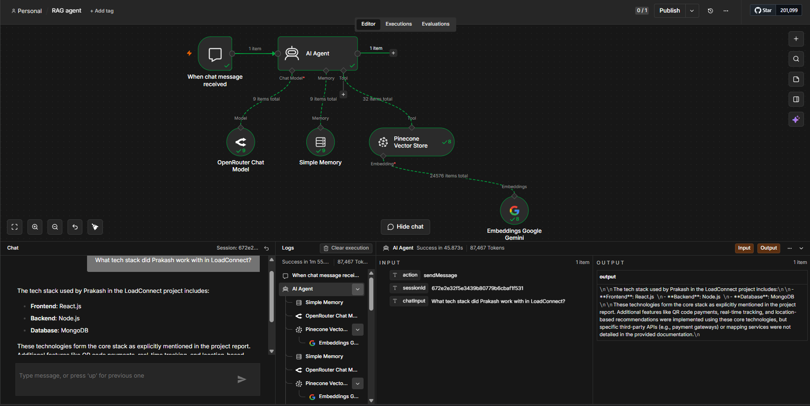
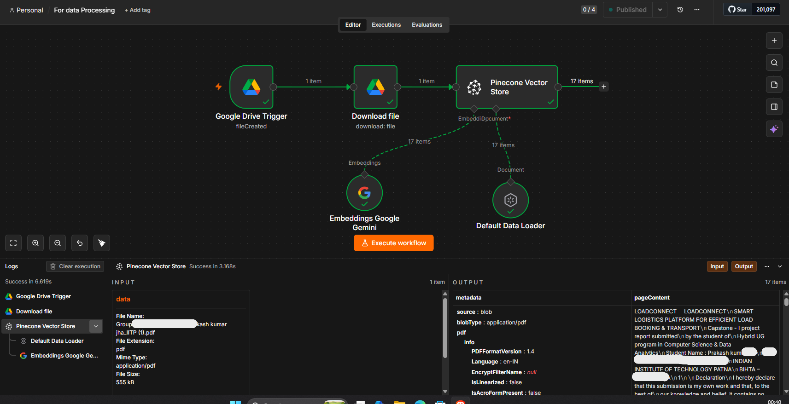

# RAG AI Agent

A Retrieval-Augmented Generation (RAG) AI Agent built with **n8n**.

This workflow processes project documentation, generates embeddings using Google Gemini, stores them in Pinecone, and allows an AI Agent to retrieve relevant information and answer questions using the stored context.

---

## Workflow

```text
Project Documentation
        │
        ▼
Google Drive
        │
        ▼
Document Loading & Chunking
        │
        ▼
Gemini Embeddings
        │
        ▼
Pinecone Vector Store
        │
        ▼
AI Agent
        │
        ├── OpenRouter Chat Model
        │
        └── Simple Memory
        │
        ▼
Relevant AI Response
```
# Features

- Convert project documentation into a searchable knowledge base.
- Automatically load and process documents using n8n.
- Generate embeddings using Google Gemini.
- Store and retrieve embeddings using Pinecone.
- Connect Pinecone as a retrieval tool for the AI Agent.
- Generate responses using OpenRouter.
- Maintain conversation context using Simple Memory.
- Ask questions about the stored documentation using natural language.

# Tech Stack
- n8n
- Google Drive
- Google Gemini Embeddings
- Pinecone
- OpenRouter
- AI Agent
- Simple Memory

# Workflow Steps
- Project documentation is uploaded to Google Drive.
- n8n downloads and processes the document.
- The document is loaded and split into chunks.
- Google Gemini generates embeddings for the document.
- The embeddings are stored in Pinecone.
- Pinecone is connected to the AI Agent as a retrieval tool.
- The user asks a question about the documentation.
- The AI Agent retrieves relevant information from Pinecone.
- OpenRouter generates the response using the retrieved context.
- Simple Memory maintains conversation context.

# Example Queries

The AI Agent can answer questions about:

- Project details
- Team members
- Team roles
- Project features
- Technologies used
- Individual contributions

## Folder Structure

```text
rag-ai-agent/
│
├── rag-agent.json
├── document-processing.json
├── README.md
├── rag-agent.png
└── document-processing.png
```

And update the **Workflow** section slightly to make the two workflows clear:

```
## Workflows

### 1. Document Processing & Ingestion

```text
Project Documentation
        │
        ▼
Google Drive
        │
        ▼
Document Loading & Chunking
        │
        ▼
Gemini Embeddings
        │
        ▼
Pinecone Vector Store

### 2. RAG AI Agent

User Query
        │
        ▼
AI Agent
        │
        ├── OpenRouter Chat Model
        ├── Simple Memory
        └── Pinecone Retrieval
        │
        ▼
Relevant AI Response
```
## Screenshots

### RAG AI Agent



### Document Processing & Vector Storage



# What I Learned

While building this workflow, I learned:

- RAG workflows in n8n
- Document loading and chunking
- Generating embeddings
- Vector storage and retrieval with Pinecone
- Connecting a vector store to an AI Agent
- Using retrieved context to generate responses
- Conversation memory with AI Agents

Understanding how information flows from documents → embeddings → retrieval → context → response was the biggest takeaway from this project.

# Future Improvements
- Improve retrieval quality
- Experiment with different embedding models
- Add more knowledge sources
- Improve chunking strategies
- Experiment with different AI Agent tools
- Import Workflow

Import the included workflow.json file into n8n and configure the required credentials for Google Drive, Google Gemini, Pinecone, and OpenRouter.

If you find this workflow useful, consider giving the repository a star⭐.
