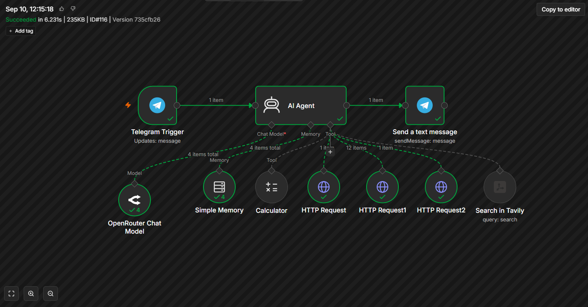
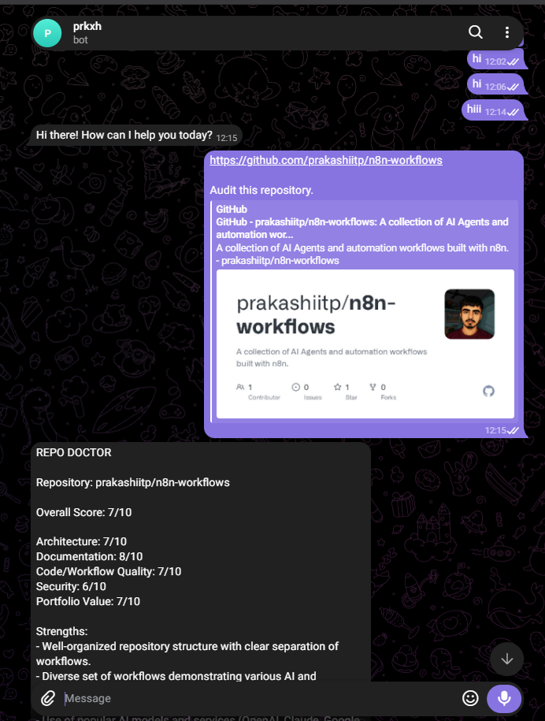

# Repo Doctor — AI GitHub Repository Auditor

Repo Doctor is an AI-powered GitHub repository auditing agent built with **n8n** and **Telegram**.

The user sends a public GitHub repository link through Telegram, and the agent inspects the repository using the GitHub REST API and AI tools. It then generates a structured audit with scores, strengths, issues, and recommended improvements.

---

## Workflow

```text
User
  │
  ▼
Telegram
  │
  ▼
AI Agent
  │
  ├── GitHub REST API
  │     ├── Repository Information
  │     ├── Repository Files & Folders
  │     └── File Contents
  │
  ├── Tavily Search
  ├── Simple Memory
  └── Calculator
  │
  ▼
Telegram Response
```


# What It Does

Send a public GitHub repository link to the Telegram bot.

Example:
```
https://github.com/prakashiitp/n8n-workflows

Audit this repository.
```
Repo Doctor then analyzes the repository and returns an audit containing:

- Architecture score
- Documentation score
- Code/Workflow Quality score
- Security score
- Portfolio Value score
- Overall score
- Strengths
- Issues
- Top improvements
- Recruiter impression

Example Output

```
REPO DOCTOR

Repository: prakashiitp/n8n-workflows

Overall Score: 7/10

Architecture: 7/10
Documentation: 8/10
Code/Workflow Quality: 7/10
Security: 6/10
Portfolio Value: 7/10

Strengths:
- Well-organized repository structure
- Practical AI and automation workflows
- Multiple real-world use cases

Top 3 Improvements:
1. Add workflow testing and validation
2. Improve security practices
3. Add more detailed workflow status
```


## Architecture

The workflow is built around an n8n AI Agent.
```
Telegram Trigger
       │
       ▼
   AI Agent
       │
       ├── OpenRouter Chat Model
       ├── Simple Memory
       ├── Calculator
       │
       ├── HTTP Request
       │      └── GitHub Repository Information
       │
       ├── HTTP Request1
       │      └── GitHub Files & Folders
       │
       ├── HTTP Request2
       │      └── GitHub File Contents
       │
       └── Search in Tavily
       │
       ▼
Send a Text Message
       │
       ▼
    Telegram
```
## GitHub REST API

Repo Doctor uses public GitHub REST API endpoints through n8n HTTP Request tools.

### Repository Information

Used to retrieve public repository metadata.
```
GET
https://api.github.com/repos/{owner}/{repo}
```
### Repository Contents

Used to inspect the repository structure and locate files and folders.
```
GET
https://api.github.com/repos/{owner}/{repo}/contents
```
### File Contents

Used to retrieve the contents of specific files such as README files, documentation, configuration files, and workflow files.
```
GET
https://api.github.com/repos/{owner}/{repo}/contents/{path}
```
No personal GitHub account connection is required for these public repository requests.

## Tools Used
### Telegram Trigger

Receives the user's repository link and audit request.

### AI Agent

Acts as the main reasoning component of Repo Doctor.

It decides which tools are required to inspect the repository and generates the final audit.

### OpenRouter Chat Model

Provides the language model used by the AI Agent.

### GitHub REST API

Provides repository metadata, directory structure, and file contents for public repositories.

### Tavily

Provides web search when additional information is required.

### Simple Memory

Maintains conversation context so follow-up questions about the repository can be handled.

### Calculator

Used when numerical calculations are required during the audit.

### Telegram

Returns the final repository audit to the user.

## Security

Repo Doctor is instructed not to expose sensitive information found inside repository files.

It does not return:

- API keys
- Access tokens
- Passwords
- Secrets
- Credential identifiers
- Private URLs
- Other sensitive configuration values

If potentially sensitive information is detected, the agent should only mention that a potential security issue exists without reproducing the sensitive value.

### Features
- Public GitHub repository auditing
- Repository structure inspection
- README and file inspection
- AI-generated repository analysis
- Architecture evaluation
- Documentation evaluation
- Workflow/code quality evaluation
- Security evaluation
- Portfolio value evaluation
- Overall repository scoring
- Specific improvement recommendations
- Recruiter-oriented feedback
- Telegram interface
- Conversation memory
- Web research support
### Tech Stack
- n8n
- AI Agent
- OpenRouter
- GitHub REST API
- Telegram
- Tavily
- Simple Memory
- Calculator
### Workflow Steps
- User sends a public GitHub repository link through Telegram.
- Telegram Trigger receives the message.
- The AI Agent identifies the repository owner and repository name.
- The GitHub REST API is used to retrieve repository information.
- The repository contents are inspected to understand the project structure.
- Important files can be retrieved and analyzed.
- Tavily can be used for additional web research when required.
- Simple Memory maintains the conversation context.
- The AI Agent evaluates the repository.
- The agent generates the structured Repo Doctor report.
- The result is sent back to the user through Telegram.

### Security

Repo Doctor is instructed not to expose sensitive information found inside repository files.

It does not return:

- API keys
- Access tokens
- Passwords
- Secrets
- Credential identifiers
- Private URLs
- Other sensitive configuration values

If potentially sensitive information is detected, the agent should mention the security concern without reproducing the sensitive value.

### Files
```
repo-doctor-ai-agent/
├── README.md
├── workflow.json
├── workflow.png
└── telegram-output.png
```
- README.md — Project documentation
- workflow.json — Exported n8n workflow
- workflow.png — n8n workflow screenshot
- telegram-output.png — Telegram audit output screenshot

### Import Workflow
- Import workflow.json into n8n.
- Configure the required AI model, Telegram, and Tavily credentials.
- Verify the GitHub HTTP Request tools.
- Activate the workflow.
- Send a public GitHub repository link through Telegram.

> Do not commit API keys, access tokens, passwords, OAuth secrets, or other sensitive credentials to the repository.

If you find this workflow useful, consider giving the repository a star.
